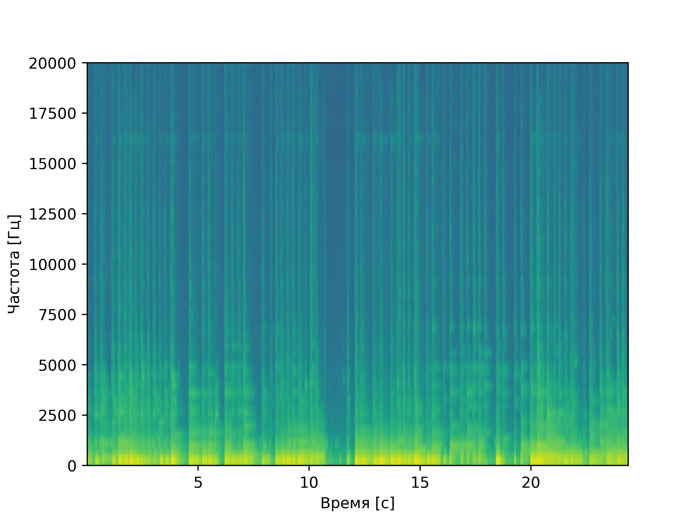
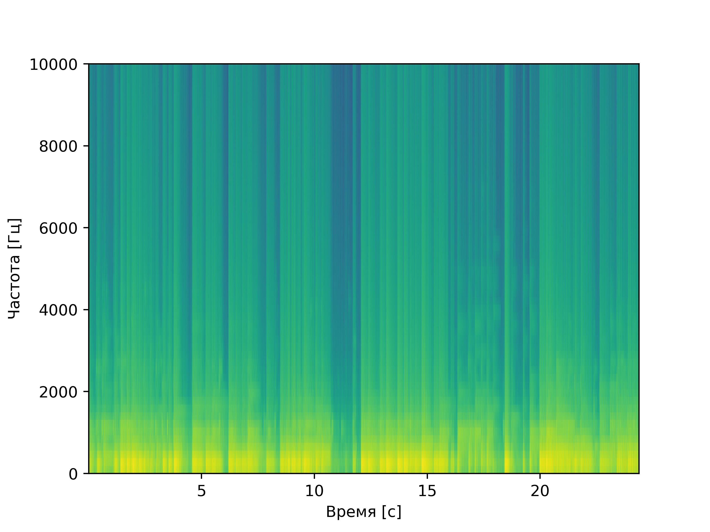
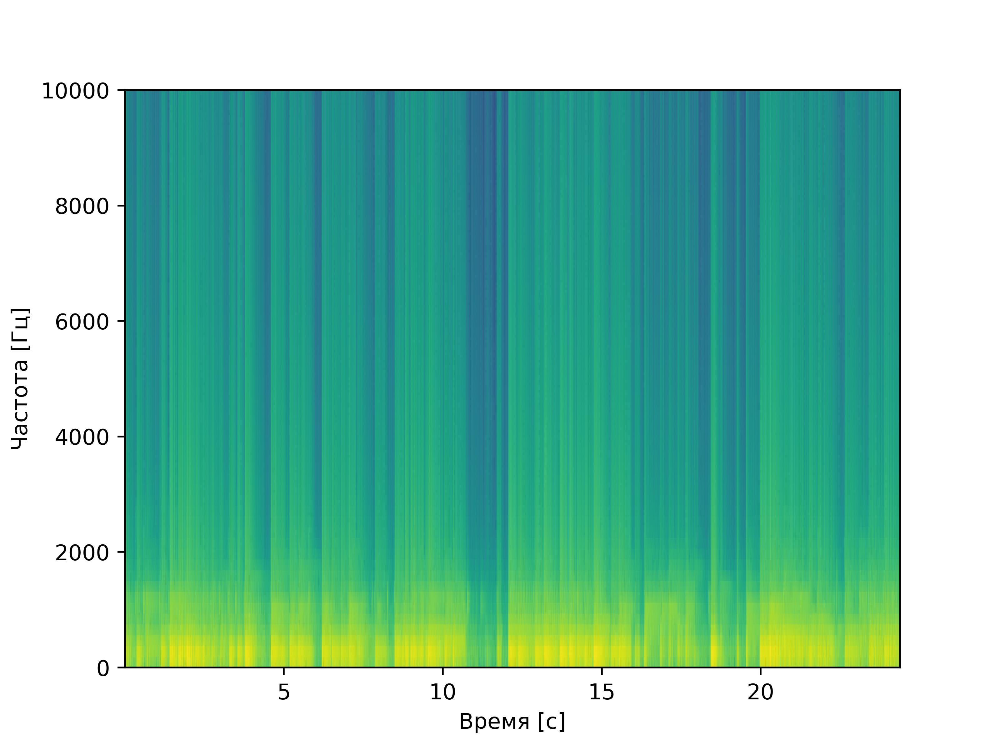

# laba9
# Лабораторная работа №9. Анализ шума
Работа выполнялась для записи игры на гитаре. Запись имела  фоновый шум. Запись была преобразована в формат WAV.
Построена спектрограмма, проведено устранение шума с помощью фильтра Савицкого-Голея и фильтра нижних частот (lowpass).

## Спектрограмма исходного звука

## Спектрограмма после фильтра Савицкого-Голея

После прогона через фильтр видно, что полезная составляющая звука находится в основном в диапазоне до
3.0 кГц. Выделим этот диапазон с помощью lowpass-фильтра.

## Спектрограмма после фильтра Савицкого-Голея и одного прохода lowpass

## Спектрограмма после фильтра Савицкого-Голея и двух проходов lowpass

## Выводы
Фильтр Савицкого-Голея хорошо подходит для устранения шума на всем диапазоне частот, а lowpass-фильтр хорошо устраняет высокочастотные шумы. Тем не менее,
существует вероятность, что при фильтрации вместе с шумом будут отброшены слишком высокие ноты.
